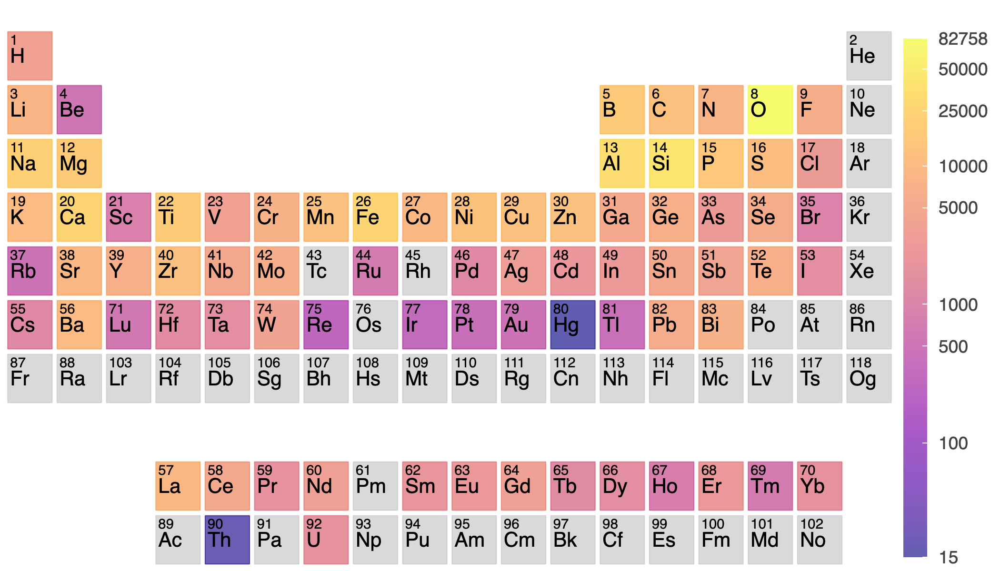

# MatSKRAFT - Composition Extraction Module

This folder contains the code and data for inferencing with the **composition extraction component** of our paper [MatSKRAFT — A framework for large-scale materials knowledge extraction from scientific tables]

```
python get_regex_from_texts.py
```

Used to extract compositions present in the tables using regular expressions. Contains regular expressions for various types of semantics representation of compositions seen in material science tables - from ranging from directly written compositions to written partially using variables or mathematical equations.

```
python -u gnn1.py --data_file ../../data/all_disco_data_test.pkl --model_save_file ../../models/model_gnn1_discomat_1.bin --hidden_layer_sizes 256 128 64 --num_heads 4 4 4 --use_regex_feat --use_max_freq_feat --res_file res_gnn1_test.pkl
```

Inference using GNN1 for extracting compositions from Single-Cell Composition tables, where the entire constituents of the compoistion are crammed in a single-cell.

```
python -u gnn2.py --data_file ../../data/all_disco_data_test.pkl --model_save_file ../../models/model_gnn2_discomat_0.bin --hidden_layer_sizes 128 128 64 --num_heads 6 4 4 --use_max_freq_feat --max_freq_emb_size 128 --use_caption --res_file res_gnn2_test.pkl
```

Inference using GNN2, which handles the rest of the tables used for reporting composition (Multi-Cell composition tables, where individual constituents of the material are reported in separate rows/columns, and Partial Information tables where only some constituents of the composition are mentioned inside the table).

```
python -u generate_final_res.py --gnn1_res_file res_gnn1_test.pkl --gnn2_res_file res_gnn2_test.pkl --res_file res_matskraft_composition_test.pkl
```

To obtain the final result from the two GNN models.

## Periodic table visualization of elemental frequency in the extracted compositions


