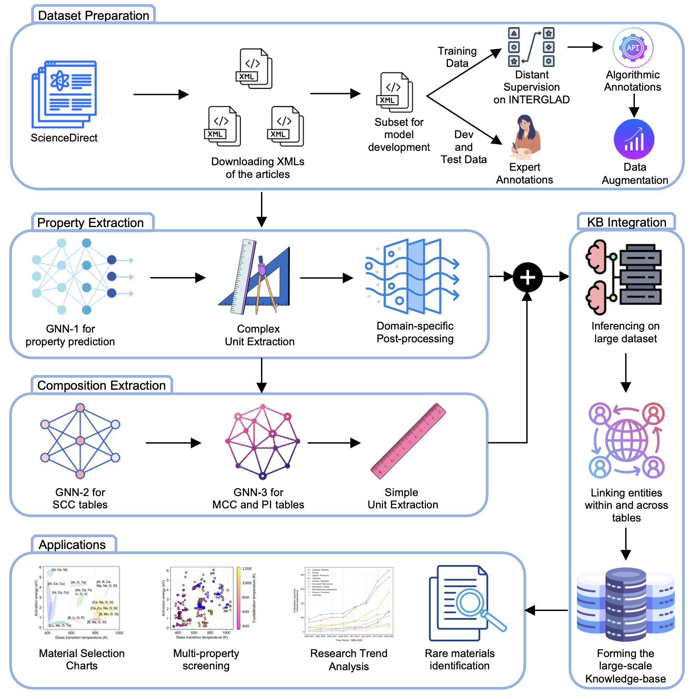

# MatSKRAFT
This repo contains all the data and code related to our paper [MatSKRAFT — A framework for large-scale materials knowledge extraction from scientific tables](https://arxiv.org/pdf/2509.10448).

## Overview

We introduce **MatSKRAFT**, a unified framework for **large-scale extraction of properties and compositions from scientific tables, followed by the knowledge-base construction**.


## Key innovations
- **Hierarchical data preparation**: integrates distant supervision, property-specific annotation algorithms, and strategic data-augmentation to construct balanced, high-quality training datasets.
- **Specialized GNN-based extraction models**: Property and composition extraction using GNN-based models, with constrained-learning and post-processing.
- **Knowledge-base integration**: links extracted compositions and properties through orientation-aware and cross-table entity linking, enabling knowledge base construction, which demonstrates impactful applications.

## Results
MatSKRaFT achieves **state-of-the-art performance** across composition and property extraction:
- For property extraction : **Precision - 92.40, Recall - 86.45, F1 score - 89.33.**
- For composition extraction : **Precision - 82.31, Recall - 62.97, F1 score - 71.35 .**
- At database scale, MatSKRaFT extracted **509,000+ entries from over 66,000 tables across 45,507 papers** with **79.04% precision**.

Crucially, other than its high accuracy, MatSKRaFT is also computationally efficient, processing a table over 19-496× faster than LLM baselines. This high efficiency, along with reliable extraction accuracy, enabled large-scale extraction in a reasonable time on a single V100 GPU.



## Ablation Study Insights

Our ablations confirm that MatSKRaFT’s high performance comes from the **synergy of multiple architectural and data-preparation components**, not from a single component:

- **Architectural components**:  
  - *Constrained learning* improves material–property linking.  
  - *Caption information* provides critical semantic context for disambiguation.  
  - *Post-processing* is the most vital precision safeguard.  

<!-- - **Data preparation strategies**:  
  - *Distant supervision (on INTERGLAD)* offers broad coverage.  
  - *Annotation algorithms* substantially extend label coverage with high precision beyond distant supervision.  
  - *Data augmentation* rebalances the long-tail by amplifying rare properties through neighborhood co-occurrence patterns (e.g., Abbe value with refractive index) combined with power-law scaling and Gaussian sampling. -->

- **Data preparation strategies**:  
  - *Distant supervision (on INTERGLAD)* provides broad initial coverage but is inherently limited to properties present in the reference database.  
  - *Annotation algorithms* systematically extend label coverage beyond distant supervision, generating high-precision training examples through multi-criteria verification.  
  - *Data augmentation* rebalances the long-tail by amplifying rare properties through neighborhood co-occurrence patterns (e.g., Abbe value with refractive index) combined with power-law scaling and Gaussian sampling.


Together, these components elevate overall performance, demonstrating that **MatSKRaFT’s strength lies in its multi-component design**.


Full detailed breakdowns are presented in the article and the [Ablation Studies](./ablation) section.


## File Structure

- [Downloading and Preprocessing](./downloading_and_preprocessing)  
  Scripts for acquiring full-text XMLs (via Elsevier API), and converting them into machine-readable tables with associated text.

- [Generating the Training Data](./train_data_generation)  
  Automated hierarchical pipeline for generating high-quality training data via distant supervision, annotation codes, and data augmentation for extracting information from materials tables.

- [Property Extraction](./Matskraft_property)  
  Contains code for extracting property names, values, and units from tables; includes unit normalization, validation, and disambiguation routines.  

- [Composition Extraction](./Matskraft_composition)  
  Contains code for extracting constituting elements or compounds, values, and corresponding units from heterogeneous table formats in materials science.

- [Knowledge-Base Construction and Comprehensive Evaluation](./Linking_the_extracted_info_and_final_evaluation)  
  Code to evaluate both the extraction tasks performed by our framework with respect to the expert-annotated test dataset. We then link the extracted compositions with properties using orientation-aware linking for intra-table and material-id linking for inter-table to form the structured knowledge-base, upon which we evaluate the final scores after linking.  
  
 - [Baseline Comparison](./baselines)  
  Contains code for baseline comparison on property and composition extraction.  


- [Ablation Studies](./ablations)  
  Contains code and configs for running ablation experiments on data preparation strategies and architecture components.


```bash
# MatSKRAFT Environment Setup
chmod +x install_requirements.sh    # Make the .sh file executable
bash install_requirements.sh        # Single command to create the entire environment
```

# Cite as
```
@article{hira2025matskraft,
  title={MatSKRAFT: A framework for large-scale materials knowledge extraction from scientific tables},
  author={Hira, Kausik and Zaki, Mohd and Krishnan, NM and others},
  journal={arXiv preprint arXiv:2509.10448},
  year={2025}
}
```


